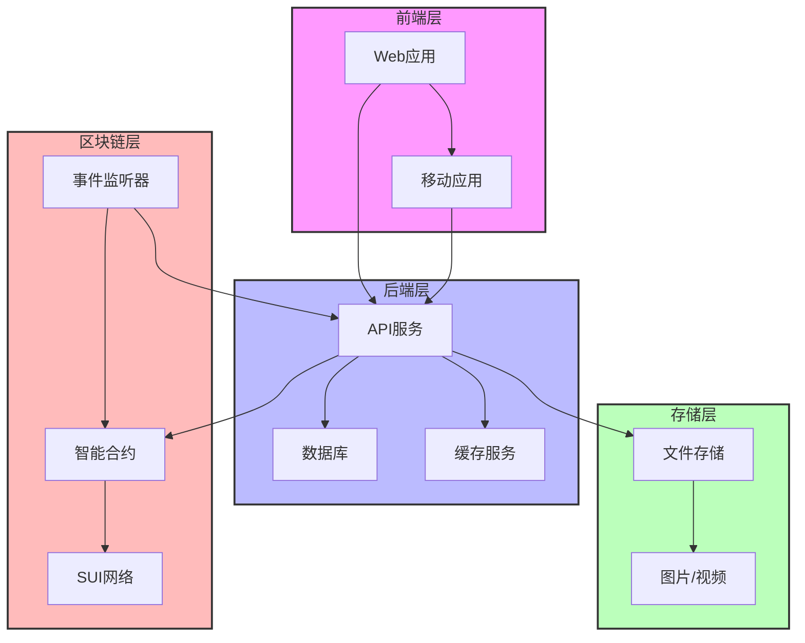
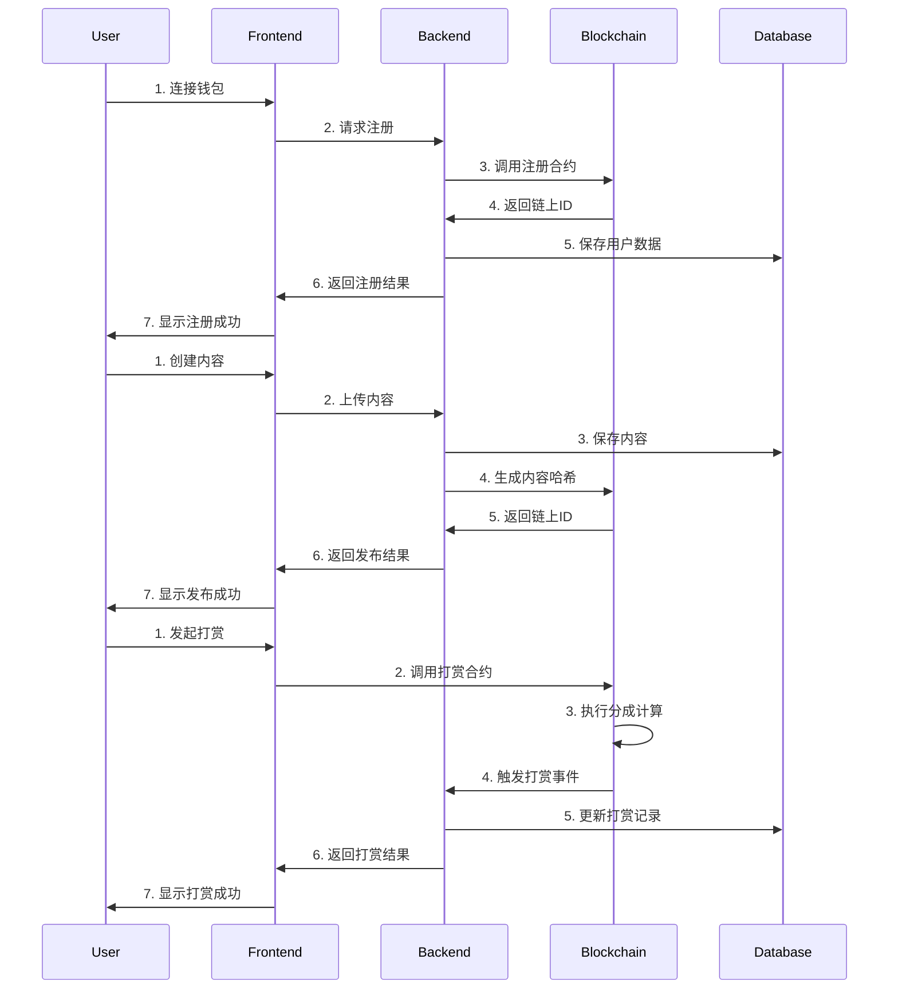
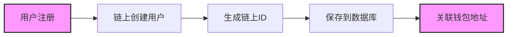
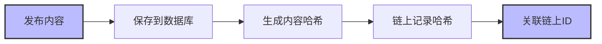
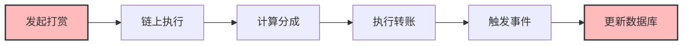

# Sphere App 架构图

## 1. 整体架构图

```mermaid
graph TD
    subgraph 前端层
        A[Web应用] --> B[移动应用]
    end

    subgraph 后端层
        C[API服务] --> D[数据库]
        C --> E[缓存服务]
    end

    subgraph 区块链层
        F[智能合约] --> G[SUI网络]
        H[事件监听器] --> F
    end

    subgraph 存储层
        I[文件存储] --> J[图片/视频]
    end

    A --> C
    B --> C
    C --> F
    H --> C
    C --> I

    style 前端层 fill:#f9f,stroke:#333,stroke-width:2px
    style 后端层 fill:#bbf,stroke:#333,stroke-width:2px
    style 区块链层 fill:#fbb,stroke:#333,stroke-width:2px
    style 存储层 fill:#bfb,stroke:#333,stroke-width:2px
```

## 2. 数据流向图

```mermaid
sequenceDiagram
    participant User
    participant Frontend
    participant Backend
    participant Blockchain
    participant Database

    %% 用户注册流程
    User->>Frontend: 1. 连接钱包
    Frontend->>Backend: 2. 请求注册
    Backend->>Blockchain: 3. 调用注册合约
    Blockchain->>Backend: 4. 返回链上ID
    Backend->>Database: 5. 保存用户数据
    Backend->>Frontend: 6. 返回注册结果
    Frontend->>User: 7. 显示注册成功

    %% 发布内容流程
    User->>Frontend: 1. 创建内容
    Frontend->>Backend: 2. 上传内容
    Backend->>Database: 3. 保存内容
    Backend->>Blockchain: 4. 生成内容哈希
    Blockchain->>Backend: 5. 返回链上ID
    Backend->>Frontend: 6. 返回发布结果
    Frontend->>User: 7. 显示发布成功

    %% 打赏流程
    User->>Frontend: 1. 发起打赏
    Frontend->>Blockchain: 2. 调用打赏合约
    Blockchain->>Blockchain: 3. 执行分成计算
    Blockchain->>Backend: 4. 触发打赏事件
    Backend->>Database: 5. 更新打赏记录
    Backend->>Frontend: 6. 返回打赏结果
    Frontend->>User: 7. 显示打赏成功
```

## 3. 数据同步流程图

### 3.1 用户数据同步

```mermaid
graph LR
    A[用户注册] --> B[链上创建用户]
    B --> C[生成链上ID]
    C --> D[保存到数据库]
    D --> E[关联钱包地址]
    
    style A fill:#f9f,stroke:#333,stroke-width:2px
    style E fill:#f9f,stroke:#333,stroke-width:2px
```

### 3.2 内容数据同步

```mermaid
graph LR
    A[发布内容] --> B[保存到数据库]
    B --> C[生成内容哈希]
    C --> D[链上记录哈希]
    D --> E[关联链上ID]
    
    style A fill:#bbf,stroke:#333,stroke-width:2px
    style E fill:#bbf,stroke:#333,stroke-width:2px
```

### 3.3 打赏数据同步

```mermaid
graph LR
    A[发起打赏] --> B[链上执行]
    B --> C[计算分成]
    C --> D[执行转账]
    D --> E[触发事件]
    E --> F[更新数据库]
    
    style A fill:#fbb,stroke:#333,stroke-width:2px
    style F fill:#fbb,stroke:#333,stroke-width:2px
``` 