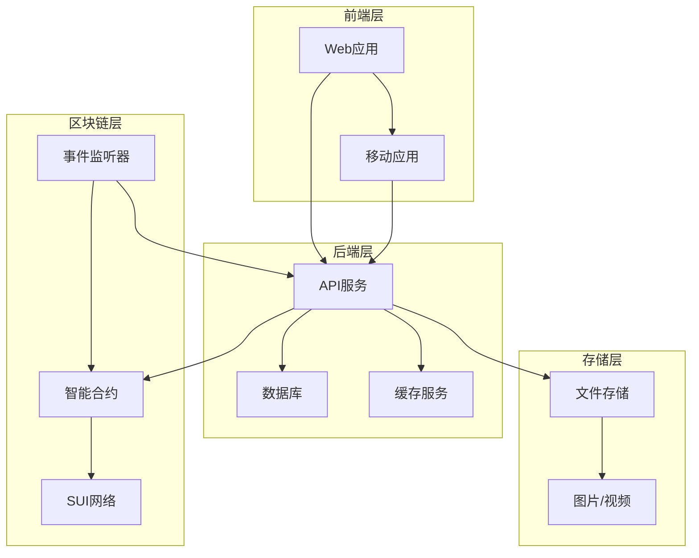
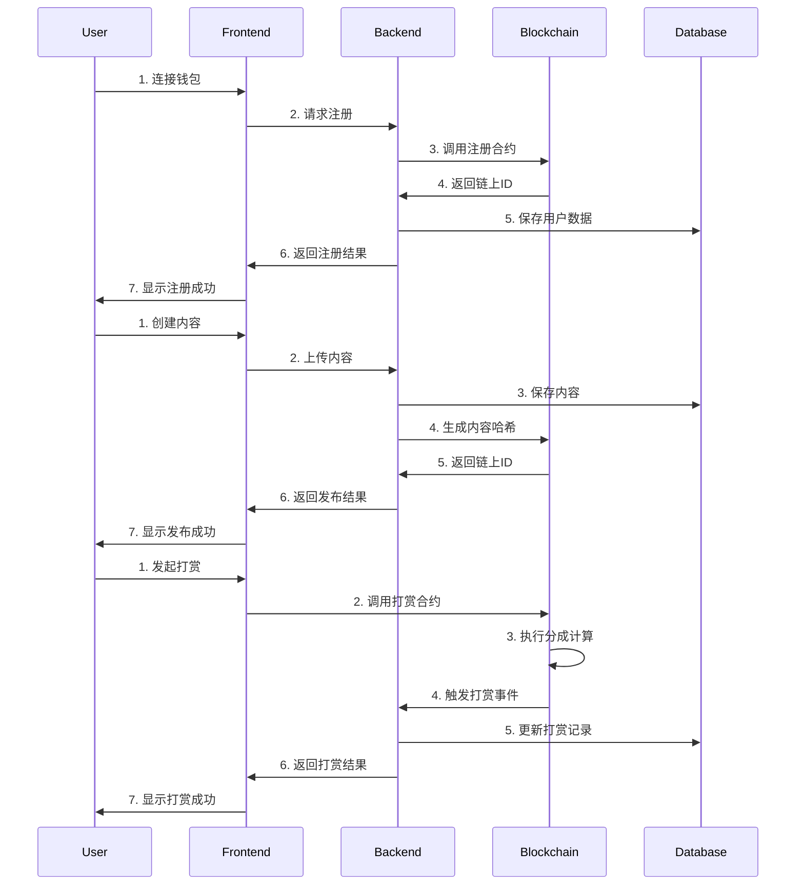
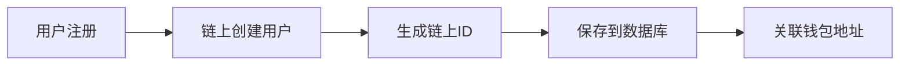
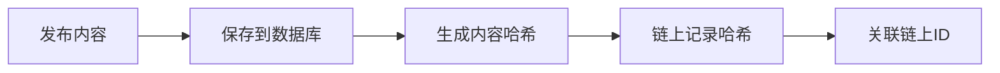
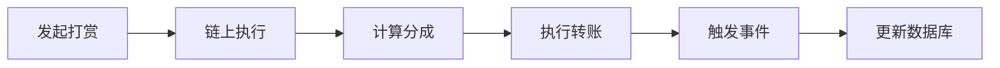

# Sphere App 系统架构设计

## 1. 整体架构图

## 2. 系统组件说明

### 2.1 前端层
- **Web应用**
  - 用户界面
  - 钱包连接
  - 内容展示
  - 交互功能

- **移动应用**
  - 移动端适配

### 2.2 后端层
- **API服务**
  - RESTful API
  - 身份验证
  - 数据同步

- **数据库**
  - PostgreSQL
  - 用户数据
  - 内容数据
  - 关系数据

### 2.3 区块链层
- **智能合约**
  - 用户管理
  - 内容管理
  - 打赏系统
  - NFT系统

- **SUI网络**
  - 交易处理
  - 状态同步
  - 共识机制

- **事件监听器**
  - 链上事件监听
  - 数据同步
  - 状态更新

### 2.4 存储层
- **文件存储**
  - 图片存储
  - 内容分发

## 3. 数据流向图

## 4. 链上链下数据同步

### 4.1 用户数据同步

### 4.2 内容数据同步

### 4.3 打赏数据同步

## 5. 关键数据流说明

### 5.1 用户注册流程
1. 用户连接钱包
2. 调用注册合约
3. 生成链上用户记录
4. 保存用户数据到数据库
5. 关联链上ID和钱包地址

### 5.2 内容发布流程
1. 用户创建内容
2. 保存内容到数据库
3. 生成内容哈希
4. 调用合约记录哈希
5. 关联链上ID

### 5.3 打赏流程
1. 用户发起打赏
2. 验证打赏金额
3. 计算分成比例
4. 执行链上转账
5. 触发打赏事件
6. 更新数据库记录

### 5.4 NFT流程
1. 创建NFT
2. 记录所有权
3. 更新用户NFT数量
4. 同步到数据库

## 6. 安全考虑

### 6.1 数据验证
- 内容哈希验证
- 签名验证
- 权限验证

### 6.2 同步机制
- 事件驱动同步
- 定时同步
- 手动同步

### 6.3 错误处理
- 交易回滚
- 数据修复
- 状态恢复 