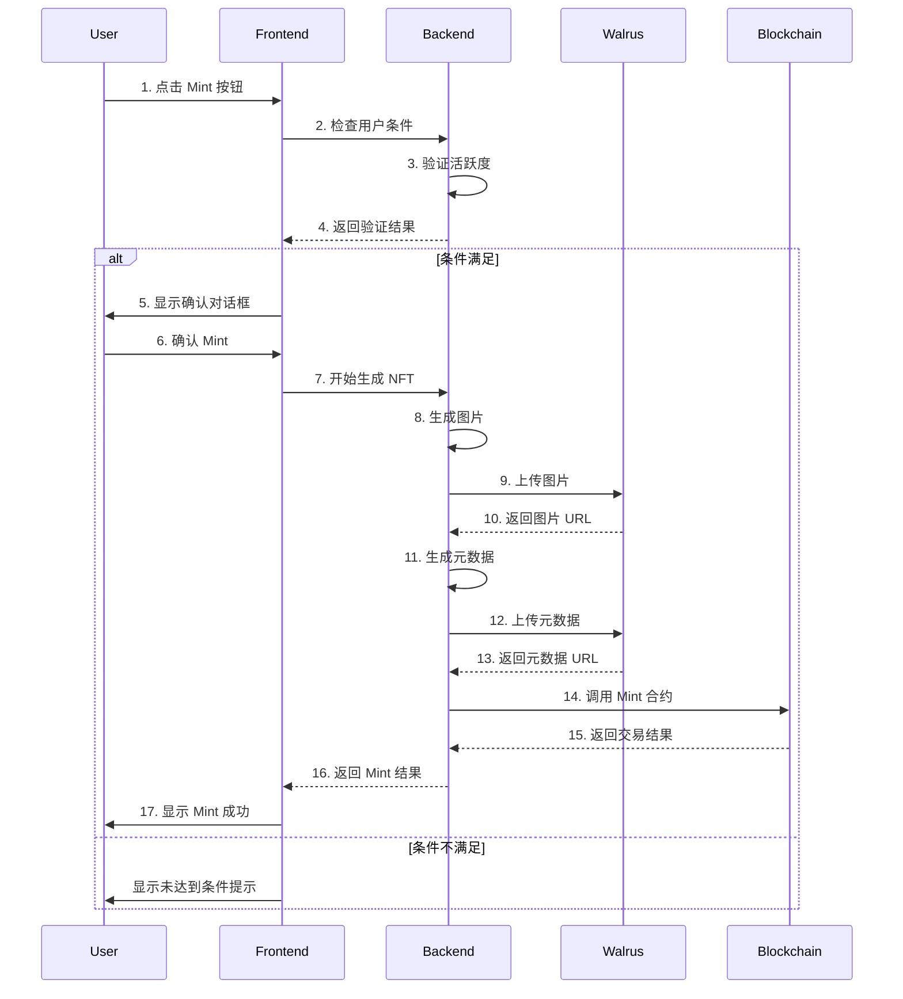

# NFT Mint 流程文档

## 1. 整体流程概述



## 2. 详细实现流程

### 2.1 条件检查
```typescript
// 检查用户是否达到 mint 条件
async function checkMintCondition(userAddress: string): Promise<boolean> {
    // 1. 获取用户活跃度数据
    const userActivity = await getUserActivity(userAddress);
    
    // 2. 检查是否达到 mint 条件
    const requiredPoints = 1000; // 示例：需要 1000 点活跃度
    return userActivity.points >= requiredPoints;
}
```

### 2.2 图片生成与上传
```typescript
// 上传图片到 Walrus
async function uploadToWalrus(imageBuffer: Buffer): Promise<string> {
    const walrusClient = new WalrusClient({
        endpoint: 'your-walrus-endpoint',
        accessKey: 'your-access-key',
        secretKey: 'your-secret-key'
    });
    
    // 生成唯一的文件名
    const fileName = `nft-${Date.now()}-${Math.random().toString(36).substring(7)}.png`;
    
    // 上传图片
    await walrusClient.putObject({
        Bucket: 'your-bucket-name',
        Key: fileName,
        Body: imageBuffer,
        ContentType: 'image/png'
    });
    
    // 返回 Walrus URL
    return `https://your-walrus-domain/${fileName}`;
}
```

### 2.3 元数据生成与上传
```typescript
// 创建 NFT 元数据并上传到 Walrus
async function createAndUploadMetadata(
    level: number,
    attributes: string[],
    imageUrl: string
): Promise<string> {
    const metadata = {
        name: `Level ${level} NFT`,
        description: "基于用户活跃度生成的 NFT",
        image: imageUrl,
        attributes: attributes,
        // 其他元数据
    };
    
    // 上传元数据到 Walrus
    const metadataBuffer = Buffer.from(JSON.stringify(metadata));
    const metadataUrl = await uploadToWalrus(metadataBuffer);
    
    return metadataUrl;
}
```

### 2.4 智能合约调用
```typescript
// 调用智能合约 mint
async function mintNFT(
    metadataUrl: string,
    userAddress: string
): Promise<void> {
    const tx = new TransactionBlock();
    tx.moveCall({
        target: `${PACKAGE_ID}::nft::mint`,
        arguments: [
            tx.pure(metadataUrl),
            tx.pure(userAddress),
        ],
    });
    
    await signAndExecuteTransaction(tx);
}
```

## 3. 前端交互实现

### 3.1 状态管理
```typescript
interface MintState {
    isChecking: boolean;
    canMint: boolean;
    isMinting: boolean;
    error: string | null;
    nftId: string | null;
}

const [mintState, setMintState] = useState<MintState>({
    isChecking: false,
    canMint: false,
    isMinting: false,
    error: null,
    nftId: null
});
```

### 3.2 用户交互处理
```typescript
async function handleMint() {
    try {
        // 1. 连接钱包
        const wallet = await connectWallet();
        const userAddress = wallet.address;
        
        // 2. 检查条件
        const canMint = await checkMintCondition(userAddress);
        if (!canMint) {
            showMessage("您尚未达到 mint 条件");
            return;
        }
        
        // 3. 显示确认对话框
        const confirmed = await showConfirmDialog({
            title: "确认 Mint NFT",
            message: "您已达到 mint 条件，是否确认 mint？",
        });
        
        if (!confirmed) return;
        
        // 4. 开始 mint 流程
        showLoading("正在生成 NFT...");
        await userMintNFT(userAddress);
        
        // 5. 显示成功消息
        showSuccess("NFT mint 成功！");
        
        // 6. 更新用户界面
        updateUserNFTs();
        
    } catch (error) {
        showError("Mint 失败：" + error.message);
    }
}
```

## 4. 错误处理机制

### 4.1 重试机制
```typescript
async function handleMintWithRetry(userAddress: string, maxRetries = 3) {
    let retries = 0;
    while (retries < maxRetries) {
        try {
            return await userMintNFT(userAddress);
        } catch (error) {
            retries++;
            if (retries === maxRetries) {
                throw new Error(`Mint 失败，已重试 ${maxRetries} 次`);
            }
            // 等待一段时间后重试
            await new Promise(resolve => setTimeout(resolve, 1000 * retries));
        }
    }
}
```

### 4.2 错误类型
- 网络错误
- 钱包连接错误
- 条件验证错误
- 图片生成错误
- 上传错误
- 合约调用错误

## 5. 注意事项

1. **安全性考虑**
   - 验证用户身份
   - 防止重复 mint
   - 保护敏感信息

2. **性能优化**
   - 使用缓存机制
   - 优化图片大小
   - 实现进度提示

3. **用户体验**
   - 清晰的错误提示
   - 友好的加载状态
   - 及时的状态更新

4. **监控与日志**
   - 记录关键操作
   - 监控错误率
   - 追踪性能指标 