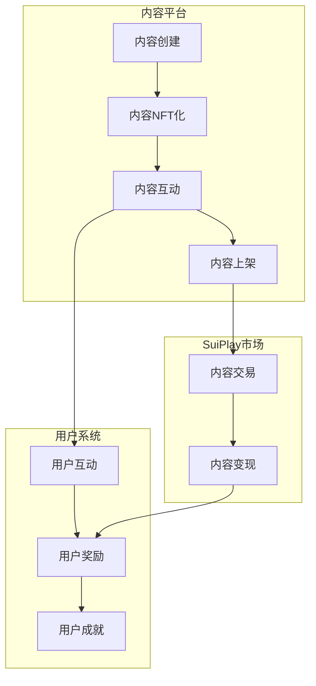
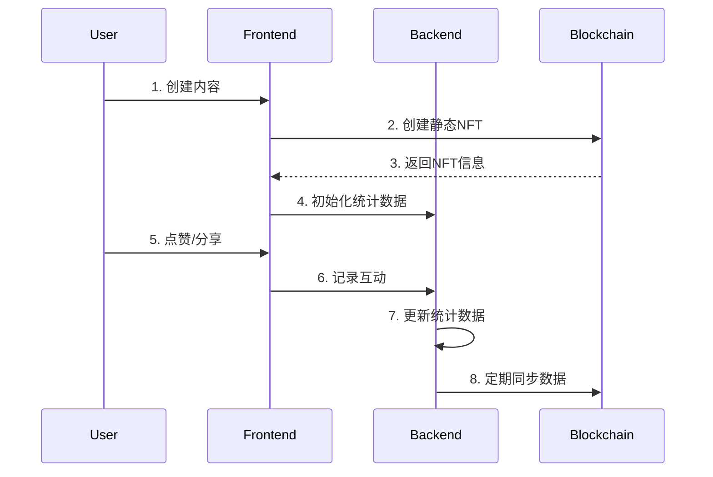

# 内容社交平台与 SuiPlay 集成方案

## 1. 整体架构



## 2. 核心功能实现

### 2.1 内容 NFT 化
```move
// 定义内容 NFT
module content {
    use sui::object::{Self, UID};
    use sui::tx_context::TxContext;
    
    struct ContentNFT has key, store {
        id: UID,
        content_id: String,
        author: address,
        create_time: u64,
        // 其他静态属性
    }
    
    struct ContentStats has key {
        id: UID,
        content_id: String,
        likes: u64,
        shares: u64,
        last_update: u64,
        // 其他动态属性
    }
}
```

### 2.2 内容互动奖励系统
```move
// 定义互动奖励
module reward {
    use sui::object::{Self, UID};
    use sui::coin::{Self, Coin};
    
    struct InteractionReward has key {
        id: UID,
        content_id: String,
        reward_amount: u64,
        // 其他奖励属性
    }
    
    // 发放互动奖励
    public fun reward_interaction(
        content: &ContentNFT,
        reward: &mut InteractionReward,
        ctx: &mut TxContext
    ) {
        // 发放奖励逻辑
    }

    public fun reward_post(
        post_id: String,
        amount: u64,
        referrer: address
    ) {
        // 1. 验证打赏金额
        assert!(validate_reward_amount(amount), EInvalidAmount);
        
        // 2. 计算分成
        let (author_share, platform_share, referrer_share) = calculate_shares(
            amount,
            get_post_type(post_id)
        );
        
        // 3. 执行转账
        transfer_rewards(
            author_share,
            platform_share,
            referrer_share,
            referrer
        );
        
        // 4. 记录打赏
        create_reward_record(
            post_id,
            amount,
            author_share,
            platform_share,
            referrer_share,
            referrer
        );
    }
}
```

### 2.3 内容市场集成
```move
// 集成 Kiosk 系统
module marketplace {
    use sui::kiosk::{Self, Kiosk, KioskOwnerCap};
    
    // 将内容 NFT 上架到市场
    public fun list_content(
        kiosk: &mut Kiosk,
        cap: &KioskOwnerCap,
        content: ContentNFT,
        price: u64
    ) {
        kiosk::place(kiosk, cap, content);
        kiosk::set_price(kiosk, cap, object::id(&content), price);
    }
}
```

## 3. 实现流程

### 3.1 内容创建流程
```typescript
// 创建内容并生成 NFT
async function createContent(content: ContentData) {
    // 1. 创建内容
    const contentId = await createContentRecord(content);
    
    // 2. 生成内容 NFT
    const nft = await mintContentNFT(contentId);
    
    // 3. 设置初始等级
    await setContentLevel(nft.id, 1);
}
```

### 3.2 内容互动流程
```typescript
// 处理内容互动
async function handleInteraction(contentId: string, type: string) {
    // 1. 记录互动
    await recordInteraction(contentId, type);
    
    // 2. 发放奖励
    await distributeReward(contentId);
    
    // 3. 更新内容等级
    await updateContentLevel(contentId);
}
```

### 3.3 内容交易流程
```typescript
// 上架内容到市场
async function listContent(contentId: string, price: number) {
    // 1. 获取内容 NFT
    const contentNFT = await getContentNFT(contentId);
    
    // 2. 上架到 Kiosk
    await listOnKiosk(contentNFT, price);
}
```

## 4. 与 SuiPlay 的关联点

### 4.1 内容变现
- 优质内容上架到 SuiPlay 市场变现
- 实现内容打赏系统

### 4.2 社交互动
- 内容互动获得奖励
- 内容创作者获得特殊身份标识

### 4.3 游戏化元素
- 成就系统
- 排行榜系统

## 5. 用户激励系统

### 5.1 用户激励结构
```typescript
interface UserIncentive {
    contentLevel: number;
    rewards: number;
    achievements: string[];
    specialBadges: string[];
}
```

### 5.2 激励计算
```typescript
// 计算用户激励
async function calculateUserIncentive(userId: string): Promise<UserIncentive> {
    // 计算用户等级
    const level = await calculateUserLevel(userId);
    
    // 计算奖励
    const rewards = await calculateUserRewards(userId);
    
    // 获取成就
    const achievements = await getUserAchievements(userId);
    
    // 获取特殊徽章
    const badges = await getUserBadges(userId);
    
    return {
        contentLevel: level,
        rewards,
        achievements,
        specialBadges: badges
    };
}
```

## 6. 数据流向



## 7. 注意事项

### 7.1 安全性考虑
- 内容所有权验证
- 交易安全保护
- 用户隐私保护

### 7.2 性能优化
- 内容缓存机制
- 交易批量处理
- 数据同步优化

### 7.3 用户体验
- 清晰的操作流程
- 及时的反馈机制
- 友好的错误提示
